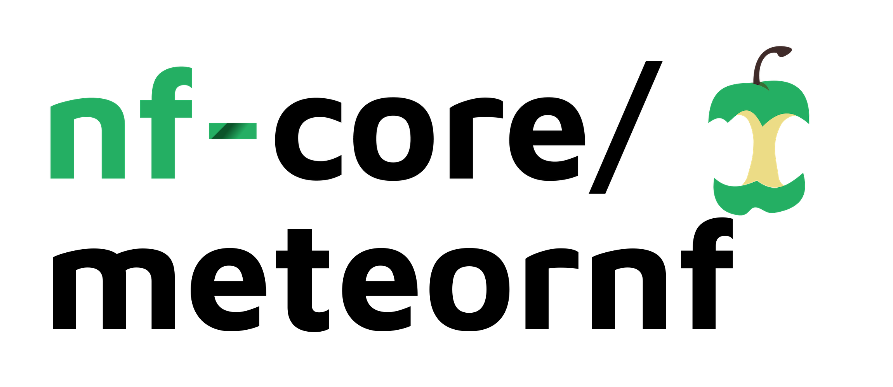

# 

## Introduction
A nextflow wrapper for the automation and parallelisation of the METEOR pipeline and its downstream analysis.

## Quick Start

1. Install [`nextflow`](https://nf-co.re/usage/installation) (`>=20.07.1`)

2. Install any of [`Docker`](https://docs.docker.com/engine/installation/), [`Singularity`](https://www.sylabs.io/guides/3.0/user-guide/), [`Podman`](https://podman.io/), [`Shifter`](https://nersc.gitlab.io/development/shifter/how-to-use/) or [`Charliecloud`](https://hpc.github.io/charliecloud/) for full pipeline reproducibility _(please only use [`Conda`](https://conda.io/miniconda.html) as a last resort; see [docs](https://nf-co.re/usage/configuration#basic-configuration-profiles))_

3. Download the pipeline and test it on a minimal dataset of paired end illumina reads by modifying the conf/upprun.config file as a template:

4. Run on the uppmax HPC cluster with a single command:

```bash
nextflow run main.nf\
	-c configs/institutional/uppmax.config\
	-c configs/conf/upprun.config.config
```
